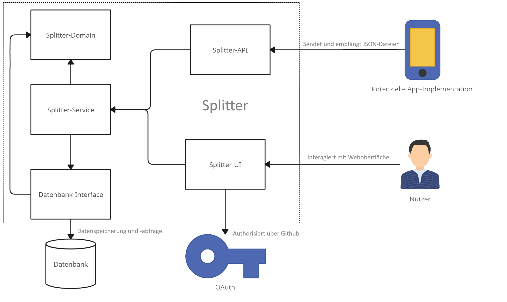

Dokumentation ProPra2

= Dokumentation des Projekts "Splitter" mit Arc42

== Einführung und Ziele

=== Aufgabenstellung
Aufgabenstellung: „Bei Geld hört die Freundschaft auf” heißt es. Rund um das Geld entstehen oft Probleme zwischen Menschen. Wir wollen uns des Themas annehmen und für Gruppen von Personen, die gemeinsame Ausgaben tätigen (zum Beispiel Wohngemeinschaften und Reisegruppen), eine Software schreiben, mit deren Hilfe die Ausgaben transparent aufgeschlüsselt und die Konten möglichst einfach ausgeglichen werden können.

Eine genaue Beschreibung der Aufgabe finden Sie in link:aufgabe.adoc[diesem Dokument].

=== Wesentliche Features
* Anmeldung über OAuth (mit GitHub-Account)
* Neue Gruppen erstellen und beteiligte über Nutzername hinzufügen
* Anlegen neuer Transaktionen und anzeigen der Details (Sponsor, Schuldner, Betrag, Grund)
* Berechnung und Anzeige der notwendigen Transaktionen, die zum Ausgleich der Ausgaben zu tätigen sind
1. Eine Person darf nie gleichzeitig Geld erhalten und verschicken müssen um die Ausgaben auszugleichen
2. Zwischen zwei Personen gibt es maximal eine Transaktion und es wird niemals Geld an sich selbst überwiesen
3. Die Anzahl der insgesamten Transaktonen soll minimal sein
* Jeder Nutzer kann Gruppen in denen er Mitglied ist schließen

* [Nachträgliche Erweiterung] REST-Schnittstelle mit JSON als Serialisierungsformat

=== Qualitätsziele
* Die Performance sollte der Aufgabe entsprechend verhältnismäßig sein (Alltagstauglich)
* Adequate Domain-Modellierung mit Berücksichtigung der Aggregate
* Einhalten der Onion-Architektur
* Accessibility der UI

=== Stakeholder
[cols="1,1,2" options="header"]
|===
|Name | Rolle | Funktion/Motivation
| _Jens Bendisposto_ | _Kunde_ | _Erwartet die Einhaltung aller Qualitätsziele, entscheidet über den Erfolg der Anwendung_
| _Projektgruppe 39 (MarcoFans)_| _Entwicklerteam_ | _Implementiert die Anwendung, sind auf Erfolg dessen angewiesen_
|===

=== Technische Randbedingungen
* Die Anwendung soll als Webanwendung mit Spring Boot umgesetzt werden
* Die Anwendung soll auf Port 9000 laufen
* Für die Datenbank soll PostreSQL verwendet werden
* Die Datenbanktest sollen mit H2 umgesetzt werden und müssen auch laufen, wenn Docker ausgeschaltet ist
* Als OAuth-Provider nutzen wir GitHub
* Als Architekturmuster ist die Onion-Architektur vorgegeben. In der Domänenschicht müssen die taktischen DDD-Muster verwendet werden.
* Zur automatischen Überprüfung von Architekturregeln, die wir explizit selbst wählen, oder implizit aus den Vorgaben folgen, wird ArchUnit verwendet.
* Der Produktivcode wird nach den Regeln des link:https://google.github.io/styleguide/javaguide.html[Google-Styleguides] geschrieben

=== Organisatorische Randbedingungen
* 3 Wochen Zeit für die Umsetzung
* 4 Stunden täglich, Mo - Fr sind vorgesehen
* Das Team entwickel, solange zeitlich gegeben, im Mob

== Kontextabgrenzung
Die Kontextabgrenzung ist in einem Diagramm festgehalten. 

== Lösungstrategie
Folgende Entscheidungen wurden getroffen um die geforderten Qualitätsziele zu erreichen

=== Technische Entscheidungen
* Thymeleaf
* Flyway
* Spring Security
* H2

=== Organisatorische Entscheidungen
* Aus Zeitgründen kann die Minimierung der notwendigen Ausgleichstransaktionen nicht mehr umgesetzt werden, Konzentration auf funktionsfähige Implementierung der Applikation
* Test-Driven-Development
* *Zeitplan:*
- *Erste Woche:* Entwicklung der Domänenlogik
- *Zweite Woche:* Weitestgehend vollständiger Funktionsumfang und Nutzer-Schnittstelle
- *Dritte Woche:* Entwicklung der REST-API, Implementation des Persistance-Layers 

=== Verteilung
* Geplant ist, dass für die Ausführung lediglich eine Docker-compose-fähige Umgebung benötigt wird. Nah befüllen einer .env Datei mit benötigten Umgebungsvariablen, soll das System inklusive Datenbank mit "docker-compose up --build" gestartet werden können.

=== Entwurfsentscheidungen
==== Design der Website und Security
* Die Vorgaben waren bezüglich dieser Punkte klar gegeben. Es wurden keine eigenen Entscheidungen getroffen.

==== Architektur
* Die Architektur wurde als Onion-Architektur vorgegeben.
* Wir haben uns für eine AggregateRoot entschieden, die als Schnittstelle zwischen Domain- und Servicelayer fungiert. 
* Es gibt keine Domain-Services. 
* Zur Sicherstellung der Architektur haben wir einene Stereotype eingeführt.

== Risiken und technische Schuld
[cols="1,3" options="header"]
|===
|Name | Beschreibung
| _Konfiguration und Verwaltung des Projekts_ | _Das Entwicklerteam hat keine Erfahrung in der Entwicklung einer Anwendung gegebener Größe._
|_Multiuser-Erfahrung_|_Da wir während der Tests nie mehr als eine Nutzer gleichzeitig aktiv war, fehlt Erfahrung in diesem Bereich. Dadurch kann es zu unvorhergesehenden Fehlern kommen._
|_Ungesicherte API_|_Die Nutzung er API benötigt keine weitere Autorisierung. Auch wenn dies in der Aufgabenstellung explizit ausgenommen war, birgt es doch ein enormes Sicherheitsrisiko._
|_Kompromitierung von Nutzerdaten_|_Da der Github-Nutzername zur Identifikation verwendet wird, kann eine Namensänderung schwerwiegende Folgen haben. Es kann zu einem komletten Datenverlust für den Nutzer führen, bzw. könnten unbeteiligte dritte, durch Verwendung des alten GitHub-Nutzernamens des eigentlichen Nutzers, auf dessen Daten zugreifen._
|===

== Glossar

* *NUTZER* - Entität, die den tatsächlichen Nutzer des Programms verkörpert

* *"SPONSOR"* - NUTZER, der Geldbetrag für Auslage bereitstellt

* *"BETTLER"* - NUTZER, der von Auslage profitiert, SPONSOR kann auch gleichzeitig BETTLER sein

* *TRANSAKTION* - Beschreibt eine getätigte Auslage bestehend aus einem SPONSOR, einer Menge an BETTLERN, einem Geldbetrag und einem Grund für die Auslage

* *GRUPPE* - Eine Menge an NUTZERN und dazugehörigen TRANSAKTIONEN

* *NOTWENDIGE TRANSAKTIONEN* - Menge an Einzelüberweisungen, die getätigt werden müssen um alle Auslagen in einer GRUPPE auszugleichen

